# 국내 주식 사전 분석 및 투자 성향 관리 도구

이 프로젝트는 사용자가 자신의 투자 성향에 맞춰 체계적이고 원칙에 기반한 트레이딩을 할 수 있도록 돕는 **국내 주식 분석용** 웹 애플리케이션입니다.

**핵심 목표:** 사용자가 자신의 투자 성향을 객관적으로 파악하고, 국내 주식 시장의 종목을 데이터 기반으로 분석하며, 모든 매매를 기록하여 성장할 수 있는 통합 환경을 제공하는 것입니다.

## ✨ 주요 기능

- **투자 성향 분석**: 첫 로그인 시 간단한 퀴즈를 통해 자신의 투자 성향을 분석받고, 마이페이지에서 언제든지 재분석할 수 있습니다.
- **인라인 종목 검색**: 페이지 내에서 즉시 국내 주식(코스피, 코스닥)을 이름 또는 종목 코드로 검색하고 결과를 확인할 수 있습니다.
- **실시간 거래량 순위**: 한국투자증권 API를 통해 제공되는 실시간 거래량 상위 종목을 **좌우 화살표로 편리하게 탐색할 수 있는** 캐러셀 형태로 한눈에 확인할 수 있습니다.
- **안정적인 종목 조회**: 거래량 순위, 종목 검색 등 모든 경로에서 중복 상장된 종목(예: 코스피/코스닥 동시 상장)을 명확히 구분하여 항상 정확한 종목 정보를 제공합니다.
- **데이터 기반 기업 분석 체크리스트**: 국내 주식의 핵심 재무 지표(PER, PBR, EPS 등)를 기반으로 한 분석 체크리스트를 제공합니다.
  - **신뢰도 높은 UI**: 분석 데이터가 없는 항목은 '정보 없음'으로 명확하게 표시하여 사용자의 신뢰도를 높였습니다.
- **주가 차트 시각화**: 상세 정보 모달에서 지난 1년간의 주가 추이를 끊김 없는 선 그래프로 직관적으로 확인할 수 있습니다.
- **거래 페이지로 이동**: 분석이 끝난 종목은 '거래하러 가기' 버튼을 통해 즉시 토스증권 페이지로 이동하여 실제 거래에 참고할 수 있습니다.
- **매매 복기 노트 (Trading Journal)**: 모든 매매의 상세 내역을 기록하고 표로 관리할 수 있습니다.
  - **자동 기록**: "거래하러 가기" 버튼을 통해 현재 시점의 종목 정보(현재가 포함)를 기반으로 매수 기록을 간편하게 추가할 수 있습니다.
  - **수동 기록 및 수정**: 과거의 매매 내역이나 누락된 정보를 "직접 입력" 및 "수정" 기능을 통해 자유롭게 추가하고 관리할 수 있습니다.
  - **편리한 날짜 입력**: 캘린더 팝업을 통해 매수일과 매도일을 직관적으로 선택할 수 있으며, 매도일이 매수일보다 빠르지 않도록 유효성을 검증합니다.
  - **다중 통화 지원**: KRW/USD 통화 설정을 지원하며, 모든 매매 기록의 금액을 현재 설정에 맞게 자동으로 변환하여 보여줍니다.
  - **시각적 명확성**: 매도 정보가 없는 항목은 'N/A' 대신 아이콘으로 표시하여 가독성을 높였습니다.
- **마이페이지**: GitHub 계정 정보와 분석된 투자 성향을 확인하고, 안전하게 로그아웃할 수 있습니다.
- **매매 기록 심층 분석**: 기록된 매매 내역을 바탕으로 성과를 분석하고 투자 결정을 복기할 수 있는 심층 분석 기능을 제공합니다.
  - **AI 기반 분석 요약 (Gemini)**: 각 거래의 상세 분석 모달에서 Gemini API를 활용하여 매수/매도 시점의 지표를 기반으로 한 투자 결정의 긍정적, 부정적 측면과 결론, 배운 점을 AI가 자동으로 분석해주는 리포트를 제공합니다.
  - **종합 성과 대시보드**: 총 실현 손익, 전체 수익률, 승률, 평균 보유 기간 등 핵심 성과 지표를 한눈에 파악할 수 있습니다.
  - **매수/매도 시점 비교 분석**: 각 거래의 **실제 매수일과 매도일**의 재무 지표(PER, PBR, EPS)를 조회하고, 이를 객관적인 '가치주'와 '성장주' 참고 기준과 비교하여 자신의 투자 결정을 객관적으로 평가할 수 있습니다.
  - **지표 변화 분석**: 보유 기간 동안의 PBR, 거래량 등 핵심 지표 변화를 분석하여 "시장의 평가가 어떻게 변했는지"에 대한 자동 분석 코멘트를 제공합니다.
  - **정확한 과거 데이터**: 한국투자증권 API를 통해 실제 매매가 이루어진 날짜의 종가를 기준으로 모든 지표를 계산하여 분석의 정확도를 높였습니다.

## 🛠️ 기술 스택

- **프레임워크**: Next.js (App Router with Turbopack)
- **언어**: TypeScript
- **UI**: Tailwind CSS, shadcn/ui, Recharts (차트)
- **인증**: NextAuth.js v5
- **데이터 소스**:
  - **동적 데이터**: 한국투자증권(KIS) API (실시간 시세, 재무 정보), Google Gemini API (AI 분석)
  - **정적 데이터**: 로컬 CSV 파일 (전체 종목 목록)
- **전역 상태 관리**: React Context API
- **클라이언트 상태**: `localStorage` (성향, 매매 기록, 통화 설정)

## 🚀 로컬 환경에서 실행하기

### 1. 저장소 복제 (Clone)

```bash
git clone https://github.com/KimDaWoo/dpp-final.git
cd dpp-final
```

### 2. 의존성 설치

이 프로젝트는 `pnpm`을 사용합니다.

```bash
pnpm install
```

### 3. 환경 변수 설정

프로젝트 루트 디렉토리에 `.env.local` 파일을 생성하고, 아래 내용을 복사하여 붙여넣으세요. **한국투자증권 API 키 발급이 필수입니다.**

```
# GitHub OAuth App credentials
AUTH_GITHUB_ID=YOUR_GITHUB_CLIENT_ID
AUTH_GITHUB_SECRET=YOUR_GITHUB_CLIENT_SECRET

# NextAuth.js 세션 암호화를 위한 비밀 키
# 터미널에서 `openssl rand -base64 32` 명령어로 생성할 수 있습니다.
AUTH_SECRET=YOUR_GENERATED_SECRET

# 한국투자증권(KIS) API Key
# https://wikis.koreainvestment.com/ 에서 발급받을 수 있습니다.
KIS_APP_KEY=YOUR_KIS_APP_KEY
KIS_APP_SECRET=YOUR_KIS_APP_SECRET

# Google Gemini API Key
NEXT_PUBLIC_GEMINI_API_KEY=YOUR_GEMINI_API_KEY

# Supabase 설정 (KIS API 토큰 영구 저장을 위해 필요)
# Supabase 프로젝트 대시보드 > Project Settings > API 에서 확인 가능합니다.
NEXT_PUBLIC_SUPABASE_URL=YOUR_SUPABASE_URL
NEXT_PUBLIC_SUPABASE_ANON_KEY=YOUR_SUPABASE_ANON_KEY
```

**KIS API 토큰 관리 변경 사항:**
기존에는 KIS API 접근 토큰이 로컬 파일 시스템에 저장되었으나, 이제는 Supabase 데이터베이스에 영구적으로 저장됩니다. 이는 Vercel과 같은 서버리스 배포 환경에서 토큰의 안정적인 관리를 보장합니다. Supabase 프로젝트에 `kis_tokens` 테이블이 올바르게 생성되어 있어야 합니다. (자세한 내용은 `SQL.md` 파일을 참조하세요.)

### 4. 개발 서버 실행

```bash
pnpm dev
```

이제 브라우저에서 `http://localhost:3000` 주소로 접속하여 애플리케이션을 확인할 수 있습니다.

---

### 5. 트러블 슈팅

```bash
npx tsc --noEmit
```

코드 수정 후, 위 명령어로 TypeScript Compiler를 활용하여 타입스크립트 에러 존재 여부를 확인할 수 있습니다.
대량의 코드 수정 후에 일괄 확인 목적을 위해 사용하는 것을 추천합니다.

---

## 📖 사용자 여정 가이드

이 가이드는 새로운 사용자가 회원가입부터 매매 분석까지, 이 애플리케이션의 핵심 기능을 어떻게 경험하게 되는지 11단계의 상세한 여정으로 안내합니다.

### 1. 시작 및 로그인
사용자는 먼저 GitHub 계정을 통해 간편하게 로그인하여 서비스를 시작합니다.

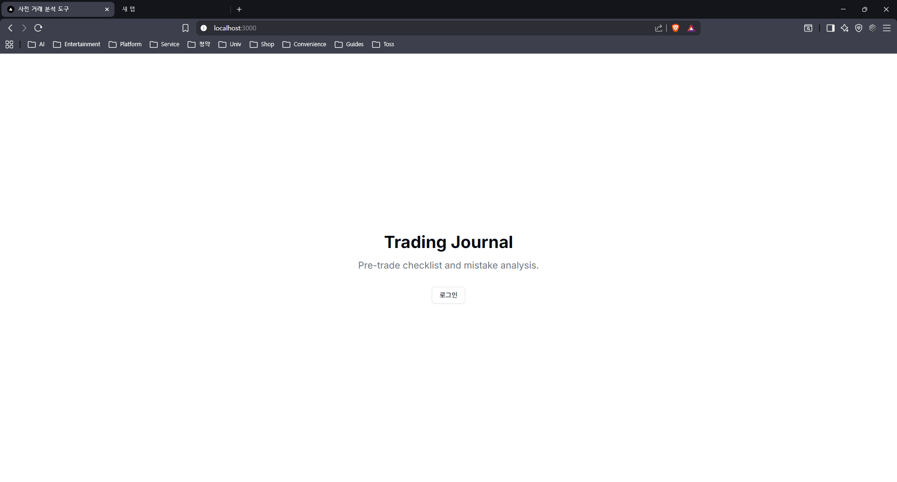

### 2. 투자 성향 분석 (최초 1회)
로그인 후, 사용자의 투자 스타일을 파악하기 위한 간단한 퀴즈가 진행됩니다. 모든 질문에 답변해야 다음 단계로 넘어갈 수 있습니다.

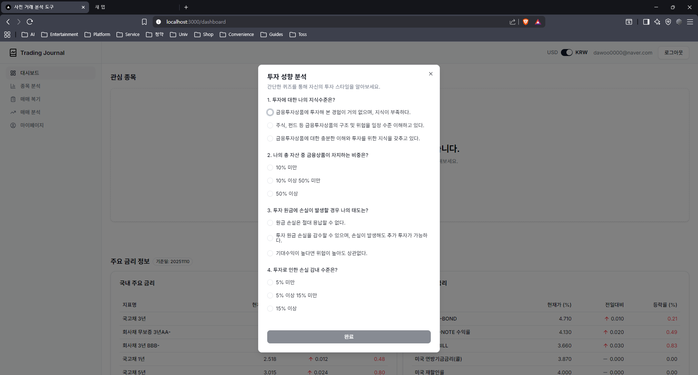

### 3. 선호 지표 설정 (최초 1회)
퀴즈를 완료하면, 종목 분석 시 중요하게 볼 재무 지표를 선택하는 화면이 나타납니다. 이 설정은 나중에 마이페이지에서 언제든지 변경할 수 있습니다.

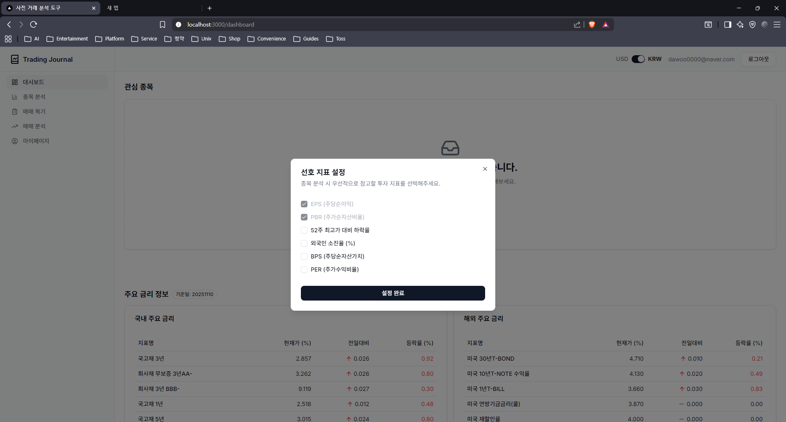

### 4. 대시보드
온보딩 절차를 마치면 대시보드로 이동합니다. 이곳에서 관심 종목 목록과 주요 경제 지표(금리 등)를 한눈에 확인할 수 있습니다.

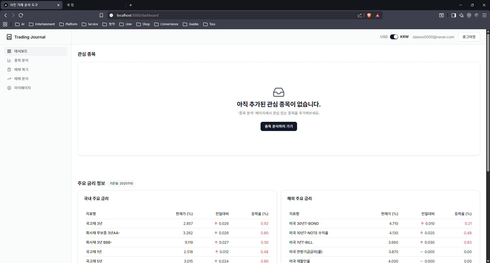

### 5. 종목 검색
`종목 분석` 페이지에서는 원하는 주식을 이름 또는 코드로 실시간 검색할 수 있으며, 하단 캐러셀을 통해 현재 거래량 순위가 높은 종목들을 탐색할 수 있습니다.

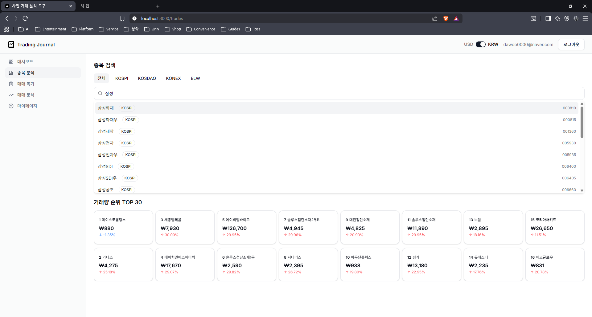

### 6. 종목 상세 분석
관심 있는 종목을 클릭하면 상세 분석 모달이 나타납니다. 이곳에서 지난 1년간의 주가 차트와 핵심 재무 지표를 기반으로 한 투자 적합도 체크리스트를 확인할 수 있습니다.

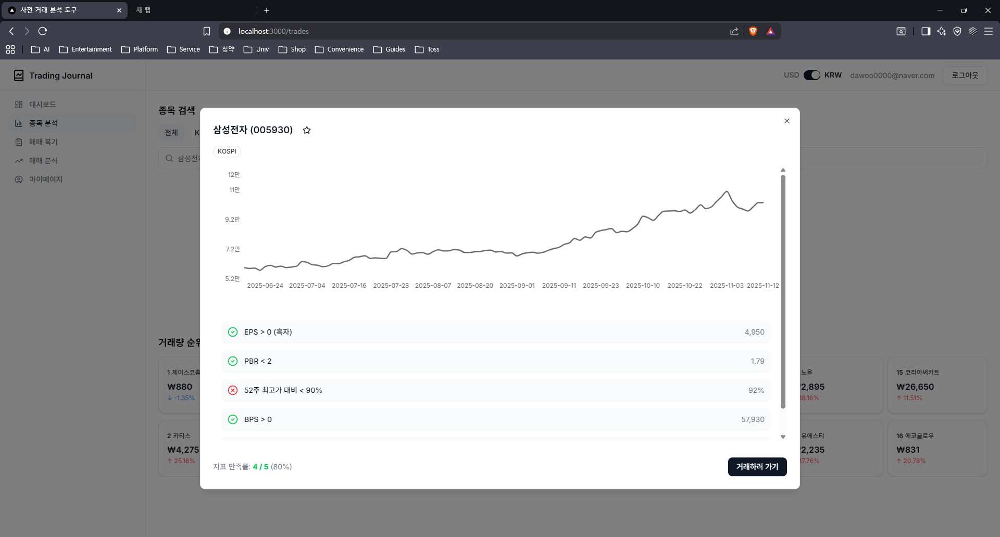

### 7. 매매 기록 추가
`상세 분석 모달`에서 매매 내역을 기록할 수도 있고, `매매 복기` 페이지에서 "직접 입력" 버튼을 통해 과거의 매매 내역을 기록할 수 있습니다. 종목, 매수/매도일, 가격, 수량 등 상세 정보를 입력하고 저장합니다.

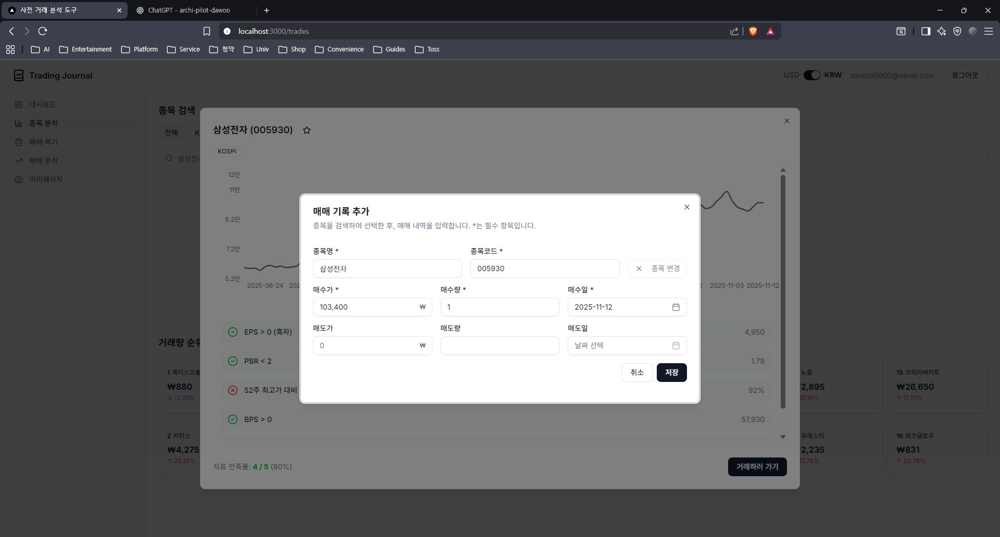

### 8. 매매 내역 확인
기록된 모든 매매 내역은 `매매 복기` 페이지의 테이블에 누적됩니다. 이곳에서 모든 거래를 한눈에 확인하고 관리할 수 있습니다. 매도 관련 정보 미입력 시, `매매 분석` 페이지에는 데이터가 누적되지 않습니다.

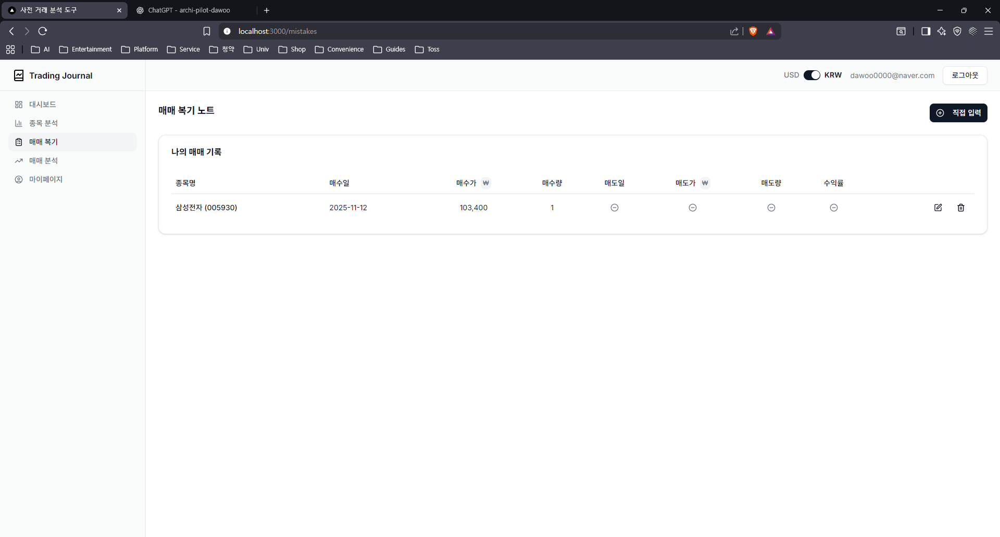

### 9. 매매 기록 수정
기존에 입력된 매매 기록에 오류가 있거나, 매도 정보를 추가하고 싶을 경우 "수정" 버튼을 눌러 언제든지 내역을 업데이트할 수 있습니다.

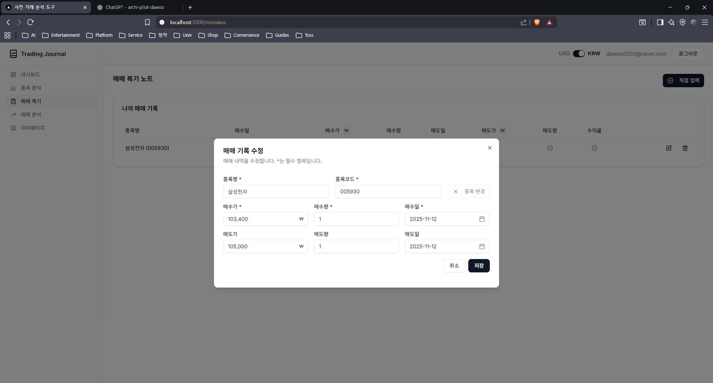

### 10. 종합 성과 분석
`매매 분석` 페이지에서는 기록된 모든 거래를 바탕으로 계산된 총 실현 손익, 수익률, 승률 등 종합적인 투자 성과를 확인할 수 있습니다.

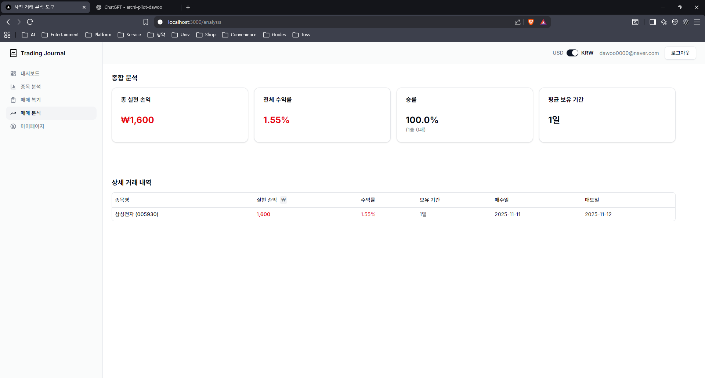

### 11. 개별 거래 심층 분석
성과 분석 테이블에서 특정 거래 내역을 클릭하면, 해당 거래의 매수 및 매도 시점의 재무 지표를 객관적인 시장 기준(가치주/성장주)과 비교하는 심층 분석 리포트를 확인할 수 있습니다. 이를 통해 자신의 투자 결정을 객관적으로 복기하고 개선점을 찾을 수 있습니다.

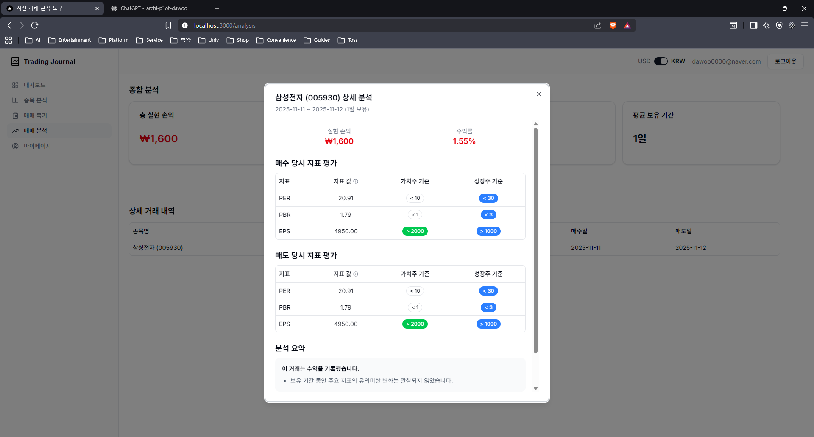