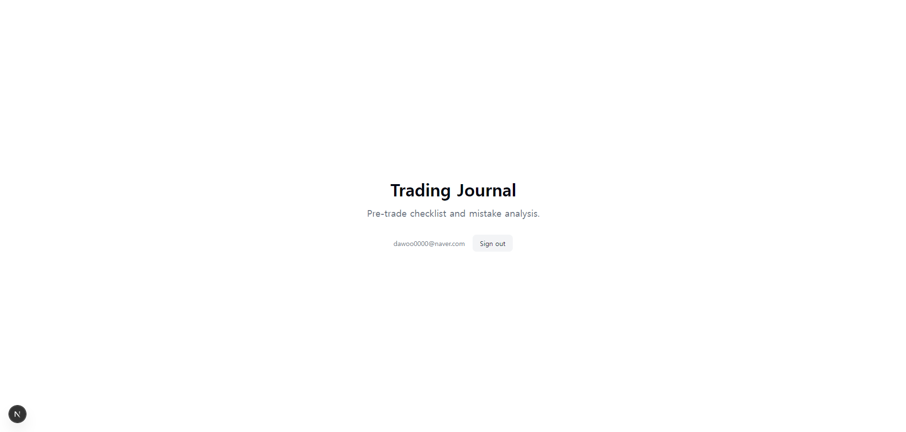

# 국내 주식 사전 분석 및 투자 성향 관리 도구

이 프로젝트는 사용자가 자신의 투자 성향에 맞춰 체계적이고 원칙에 기반한 트레이딩을 할 수 있도록 돕는 **국내 주식 분석용** 웹 애플리케이션입니다.

**핵심 목표:** 사용자가 자신의 투자 성향을 객관적으로 파악하고, 국내 주식 시장의 종목을 데이터 기반으로 분석하며, 모든 매매를 기록하여 성장할 수 있는 통합 환경을 제공하는 것입니다.



## ✨ 주요 기능

- **투자 성향 분석**: 첫 로그인 시 간단한 퀴즈를 통해 자신의 투자 성향을 분석받고, 마이페이지에서 언제든지 재분석할 수 있습니다.
- **인라인 종목 검색**: 페이지 내에서 즉시 국내 주식(코스피, 코스닥)을 이름 또는 종목 코드로 검색하고 결과를 확인할 수 있습니다.
- **실시간 거래량 순위**: 한국투자증권 API를 통해 제공되는 실시간 거래량 상위 종목을 **좌우 화살표로 편리하게 탐색할 수 있는** 캐러셀 형태로 한눈에 확인할 수 있습니다.
- **안정적인 종목 조회**: 거래량 순위, 종목 검색 등 모든 경로에서 중복 상장된 종목(예: 코스피/코스닥 동시 상장)을 명확히 구분하여 항상 정확한 종목 정보를 제공합니다.
- **데이터 기반 기업 분석 체크리스트**: 국내 주식의 핵심 재무 지표(PER, PBR, EPS 등)를 기반으로 한 분석 체크리스트를 제공합니다.
  - **신뢰도 높은 UI**: 분석 데이터가 없는 항목은 '정보 없음'으로 명확하게 표시하여 사용자의 신뢰도를 높였습니다.
- **주가 차트 시각화**: 상세 정보 모달에서 지난 1년간의 주가 추이를 끊김 없는 선 그래프로 직관적으로 확인할 수 있습니다.
- **거래 페이지로 이동**: 분석이 끝난 종목은 '거래하러 가기' 버튼을 통해 즉시 토스증권 페이지로 이동하여 실제 거래에 참고할 수 있습니다.
- **매매 복기 노트 (Trading Journal)**: 모든 매매의 상세 내역을 기록하고 표로 관리할 수 있습니다.
  - **자동 기록**: "거래하러 가기" 버튼을 통해 현재 시점의 종목 정보(현재가 포함)를 기반으로 매수 기록을 간편하게 추가할 수 있습니다.
  - **수동 기록**: 과거의 매매 내역이나 누락된 정보를 "직접 입력" 기능을 통해 자유롭게 추가하고 관리할 수 있습니다.
- **마이페이지**: GitHub 계정 정보와 분석된 투자 성향을 확인하고, 안전하게 로그아웃할 수 있습니다.

## 🛠️ 기술 스택

- **프레임워크**: Next.js (App Router with Turbopack)
- **언어**: TypeScript
- **UI**: Tailwind CSS, shadcn/ui, Recharts (차트)
- **인증**: NextAuth.js v5
- **데이터 소스**:
  - **동적 데이터**: 한국투자증권(KIS) API (실시간 시세, 재무 정보)
  - **정적 데이터**: 로컬 CSV 파일 (전체 종목 목록)
- **전역 상태 관리**: React Context API
- **클라이언트 상태**: `localStorage` (성향, 매매 기록, 통화 설정)

## 🚀 로컬 환경에서 실행하기

### 1. 저장소 복제 (Clone)

```bash
git clone https://github.com/KimDaWoo/dpp-final.git
cd dpp-final
```

### 2. 의존성 설치

이 프로젝트는 `pnpm`을 사용합니다.

```bash
pnpm install
```

### 3. 환경 변수 설정

프로젝트 루트 디렉토리에 `.env.local` 파일을 생성하고, 아래 내용을 복사하여 붙여넣으세요. **한국투자증권 API 키 발급이 필수입니다.**

```
# GitHub OAuth App credentials
AUTH_GITHUB_ID=YOUR_GITHUB_CLIENT_ID
AUTH_GITHUB_SECRET=YOUR_GITHUB_CLIENT_SECRET

# NextAuth.js 세션 암호화를 위한 비밀 키
# 터미널에서 `openssl rand -base64 32` 명령어로 생성할 수 있습니다.
AUTH_SECRET=YOUR_GENERATED_SECRET

# 한국투자증권(KIS) API Key
# https://wikis.koreainvestment.com/ 에서 발급받을 수 있습니다.
KIS_APP_KEY=YOUR_KIS_APP_KEY
KIS_APP_SECRET=YOUR_KIS_APP_SECRET
```

### 4. 개발 서버 실행

```bash
pnpm dev
```

이제 브라우저에서 `http://localhost:3000` 주소로 접속하여 애플리케이션을 확인할 수 있습니다.